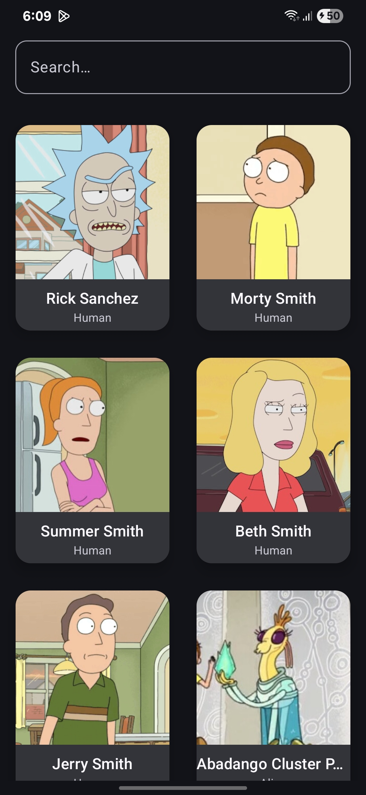
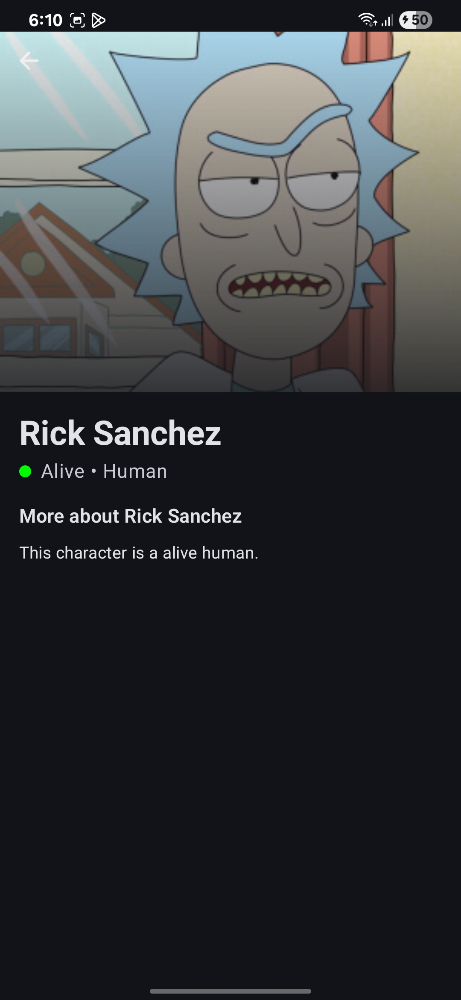
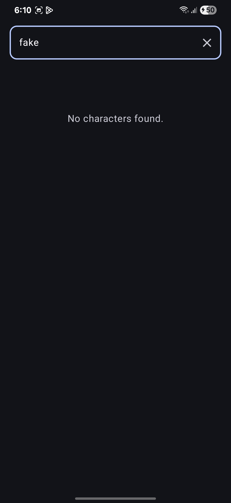
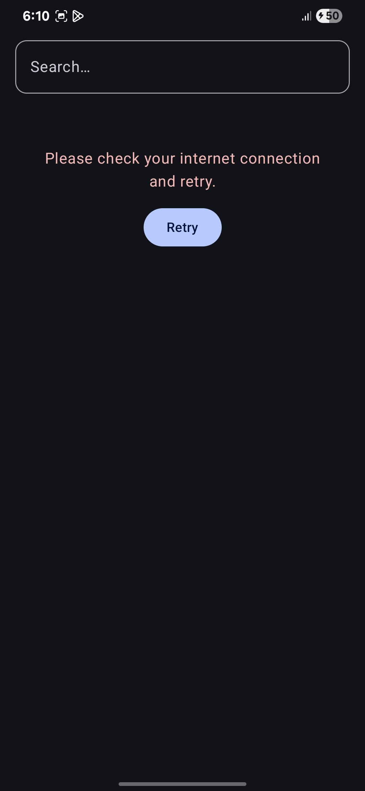
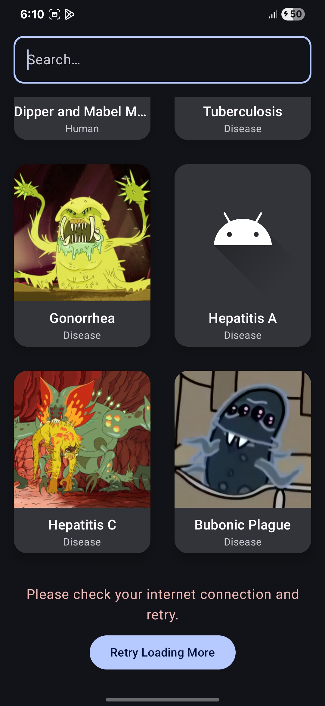

# 📱 Anime Characters App

An Android application built with Kotlin, Jetpack Compose, and modern Android development tools. It fetches data from the [Rick and Morty API](https://rickandmortyapi.com/) and displays a paginated list of characters, including character search and detail views.

---

## 🚀 Features

- Jetpack Compose UI
- Character list with pagination using `Paging 3`
- Character search with filtering
- Character details screen
- Clean Architecture with Domain, Data, and Presentation layers
- Dependency Injection with Hilt
- Retrofit for networking
- Coil for image loading

---

## 🧰 Tech Stack

- **Kotlin**
- **Jetpack Compose**
- **Paging 3**
- **Retrofit + OkHttp**
- **Hilt (DI)**
- **ViewModel + StateFlow**
- **Coil**
- **JUnit + MockK** for testing

---

## 🛠️ Build & Run Instructions

### ✅ Prerequisites

- Android Studio Giraffe or later
- JDK 17+
- Minimum SDK: 24
- Compile SDK: 34

### 🔧 Clone the Repository

```bash
git clone https://github.com/mokhtar92/AnimeCharacters.git
cd AnimeCharacters
```

### ▶️ Run the App

1. Open the project in **Android Studio**.
2. Connect a device or start an emulator.
3. Click **Run** (▶️) or use:

```bash
./gradlew installDebug
```

---

## 🏗️ Architecture Overview

This project follows a **Clean Architecture** approach, separating concerns across three major layers:

### 1. Domain Layer
- Contains business logic and use cases.
- Defines models (`CharacterModel`) and use cases (`FetchCharacters`, `FilterCharacters`).

### 2. Data Layer
- Implements repositories and data sources.
- Interacts with the Rick & Morty API.
- Uses DTOs and mappers to convert data between layers.

### 3. Presentation Layer
- Contains UI logic using **Jetpack Compose**.
- Uses `ViewModel`, `StateFlow`, and `PagingData` for reactive UI.
- `CharacterListViewModel` coordinates the interaction between UI and the domain layer.

### Why This Architecture?
- Promotes testability and modularity.
- Separation of concerns simplifies long-term maintenance.
- Encourages scalability for adding new features (e.g., episodes, locations).

---

## 📸 Screenshots

| Home Screen | Details Screen |
|-------------|----------------|
|  |  |

| No Character Found | No Internet |
|--------------------|-------------|
|  |  |

| Paging Error |  |
|--------------|--|
|  |  |


---

## 📄 License

MIT License. See `LICENSE` file for details.
